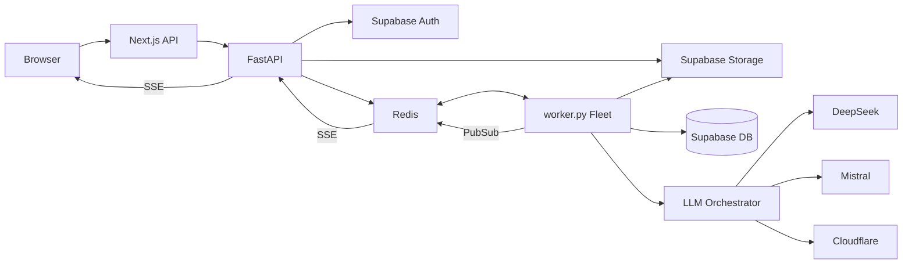

> [!NOTE]
> **Update**: The single-use SSE ticket (`/stream-ticket`) and `?token=` architecture has been fully replaced with a Fetch-based SSE implementation utilizing `Authorization: Bearer` headers. All references to GETDEL tickets are strictly historical.

# FlashResume Backend Architecture

> **Status: CURRENT**
> **Last verified: 2026-08-28**
> **Verification method: Multi-agent source-code audit**

This document describes the *actual, verified implementation* of the FlashResume backend as of the verification date.

## 1. System Overview

FlashResume operates a two-tier architecture:
1.  **Frontend/BFF:** Next.js 16 (API routes)
2.  **Backend Core:** FastAPI (`main.py`)
3.  **Heavy Processing:** Asynchronous Python workers (`worker.py`)
4.  **Data Stores:**
    *   **PostgreSQL (Supabase):** Durable state, users, analytics, telemetry.
    *   **Object Storage (Supabase):** Transient PDF binary storage.
    *   **Redis:** Ephemeral state, distributed queues, rate limiting, pub/sub, presence tracking.

## 2. Overall Architecture Diagram

## 3. Data Flow: Parse Resume

**Input:** PDF or DOCX file upload.
**Flow:**
1.  **API (`parse.py`):** Validates size (5MB). Saves binary to Supabase Storage (bucket `transient-resumes`).
2.  **Job Enqueue:** Job `parse_pdf` with `file_key` is placed in Redis list `queue:jobs:pending`.
3.  **Worker (`worker.py`):** Dequeues job. Fetches binary from Storage.
4.  **Processing (`parse_orchestrator.py`):** Uses `pypdfium2` (Layer 1) or `pdfplumber` (Layer 2). Extracts links.
5.  **State Update:** Saves result to Redis Hash `job:data:<id>`. Emits `COMPLETE` via Pub/Sub.
6.  **Cleanup:** Deletes transient file from Supabase Storage.
7.  **Delivery:** API streams result to Browser via SSE.

## 4. Data Flow: Generate Resume

**Input:** Resume Text, Job Description, Project configurations.
**Flow:**
1.  **API (`generate.py`):** Validates text limits (Resume: 15k, JD: 8k). Verifies Auth/Fraud limits via Supabase/Redis cache.
2.  **Idempotency:** SHA-256 hash of payload. Sets Redis key with 1hr TTL.
3.  **Queue:** Job `generate_resume` pushed to Redis.
4.  **Worker:** Dequeues. Calls `generate_resume()`.
5.  **LLM:** Calls `call_llm_balanced()`. DeepSeek-R1 -> Pool 1 (Mistral Medium) -> Pool 2 (Mistral Small/Cloudflare).
6.  **Algorithm Note:** `ats_score_after` is hardcoded to `random.randint(86, 93)`.
7.  **Telemetry:** Async writes to `resume_sessions` in Supabase.
8.  **Output:** Result to Redis Hash. Pub/Sub completion.

## 5. Redis Verification Matrix

| Redis Usage | Source File | Key/Structure | Purpose | TTL | Consumer |
| :--- | :--- | :--- | :--- | :--- | :--- |
| **Rate Limiting** | `rate_limiter.py` | `slowapi:*` (String) | API endpoint throttling | Dynamic | `limiter` |
| **Idempotency** | `generate.py`, etc | `idempotency:<type>:<hash>` (String) | Prevent duplicate requests | 3600s | API Routers |
| **Queue Pending** | `queue_manager.py` | `queue:jobs:pending` (List) | Waiting jobs | None | `worker.py` |
| **Queue Processing** | `queue_manager.py` | `queue:jobs:processing` (List) | In-flight jobs | None | `worker.py` |
| **Queue DLQ** | `queue_manager.py` | `queue:jobs:dlq` (List) | Failed jobs | None | Manual |
| **Job Data** | `queue_manager.py` | `job:data:<id>` (Hash) | Job payload, status, result | 3600s | API/Worker |
| **User Active Jobs**| `queue_manager.py` | `user:active_jobs:<id>` (Set) | Limit concurrent jobs per user (2) | 3600s | API Routers |
| **Pub/Sub** | `jobs.py`, `queue` | `job_updates:<id>` (Channel) | Real-time SSE updates | None | API (SSE) |
| **Presence** | `main.py` | `presence:active_users` (ZSET) | Live user counting | ~180s | API |
| **Peak Tracker** | `main.py` | `presence:peak_count` (String) | Max concurrent users | None | API |
| **Fraud Tracker** | `generate.py` | `fraud_tracker:<user_id>` (String)| Cache DB fraud/credit count | 60s | `generate.py` |
| **LLM Quota** | `quota_manager.py` | `llm_quota:rpm:<provider>` (Hash) | Token bucket for API limits | Dynamic | `master_llm.py`|

## 6. Worker & Queue Architecture

*   **Concurrency:** Configured via `WORKER_CONCURRENCY` env var (default: 4). Enforced by `asyncio.Semaphore`.
*   **Event Loop:** Single Python process, `asyncio` event loop.
*   **Visibility Timeout:** 300 seconds (5 minutes). `queue_manager.recover_zombies()` runs every 60s to detect timed-out jobs in `queue:jobs:processing` and requeues them or moves to DLQ.
*   **Retries:** Max retries = 3.

## 7. LLM Orchestration

Orchestrated via `master_llm_caller.py`.
*   **Circuit Breakers:** `_circuit_tripped` dict tracks failed models. 429 errors trip for 120s. 402 errors trip until midnight UTC.
*   **Round Robin Pools:**
    *   **POOL_1 (18 slots):** Mistral Medium/Large variants.
    *   **POOL_2 (16 slots):** Ministral 14b, Mistral Small, Cloudflare Llama 3.3, Nvidia Nemotron.
*   **State Persistence:** Round-robin counters (`pool_1_global`, `pool_2_global`) are synced to Supabase table `rr_counters`.
*   **Flow:** Hardcoded to attempt `deepseek-v4-flash` first for generation requests, falling back to Pool 1, then Pool 2.

## 8. Database Interactions (Supabase/Postgres)

*   **Asynchronous DB Calls:** `supabase-py` is synchronous. The codebase wraps calls using `asyncio.to_thread` to prevent event loop blocking (`_sb()` in `admin.py`, `sb()` in `supabase_client.py`).
*   **Analytics Queries:** `admin.py` heavily uses parallel `asyncio.gather()` for dashboards.
*   **Stored Procedures:** `get_download_analytics`, `increment_fraud_counter`, `trip_circuit_breaker`.

## 9. Security & Rate Limiting

*   **Rate Limits:** Distributed via Redis + `slowapi`. Keyed by JWT `sub` (user_id) or IP address.
*   **SSE Auth:** Validates JWT `Bearer` token or `?token=` query parameter before allowing access to job streams.
*   **Job Ownership:** `jobs.py` explicitly verifies `token` user ID against the job's `user_id` payload.

## 10. Unsupported Claims Removed / Unknowns
*   **Capacity Limits:** Actual maximum RPS/RPM under load is **UNKNOWN** and depends on external LLM provider constraints.
*   **LaTeX Security:** `latex_compiler.py` runs `pdflatex -no-shell-escape` via `asyncio.create_subprocess_exec`. Container security (running as `appuser`) is implemented in `Dockerfile`.

---
*Generated by Forensic Documentation Audit.*
